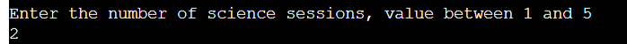
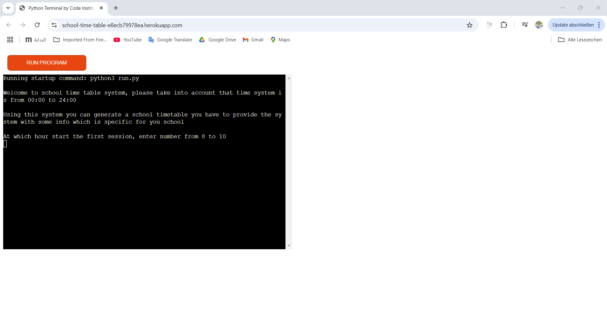

# School timetable 
---
This is an algorithm to create a school time table 
Every time the user executes the application he/she gets a different result

## instruction to use the app
### Features:
1. The user must enter the start time to the school 

    * if user entered a wrong number a wrong message will appear
    
2. How many minutes lasts the session

3. How many minutes are between sessions

4. How many breaks per day, for ex: 2

    * At which time starts start 1st break 

    * How many minutes lasts the 1st break                              
    
    * At which time starts the 2nd break

    * How many minutes lasts the 2nd break                          

5. How many sessions on Monay

6. How many sessions on Tuesday

7. How many sessions on Wedensday

8. How many sessions on Thursday

9. How many sessions on Friday

10. How many mathematics's sessions

11. How many pyhisc's sessions

12. How many chemistry's sessions

13. How many science's sessions

14. How many geography's sessions

15. How many english's sessions

16. How many french's sessions

17. How many informatics's sessions

18. How many politics's sessions

19. How many sport's sessions

20. How many music's sessions

21. How many art's sessions

## Future plan
* Take in account the priority so the subjects that has higher priority would be in the first 3 sessions in the day
* Work on the favorite days for the teachers so Mathematics teacher prefers to work on Monday and Wednesday
* Work on the not suitable days for the teacher so Mathematics teacher coudln't work on Tuesday

## Languages
* Python 3.11.9: used to anchor the project and direct all application behavior
* JavaScript: used to provide the start script needed to run the Code Institute mock terminal in the browser
* HTML used to construct the elements involved in building the mock terminal in the browser

## Tools:
---
* VSCode was used as the main tool to write and edit code.
* Git was used for the version control of the website.
* GitHub was used to host the code of the website.

## Testing
---
* All clear, no errors found except two functions, because they have a long name when passing through [CI Python Linter](https://pep8ci.herokuapp.com/#)
    * run.py
    
    * user_input.py
    
    * validation.py
    
    * presentaion.py
    
    * break_per_day.py
    

### Manual Testing 
- Enter an invalid start hour, i got an error message and return to input the same field | PASS

- Enter invalid period for the session, i got an error message and return to input the same field | PASS

- Enter invalid start time for the break, i got an error message and return to input the same field | PASS

- Enter sum of sessions per week not equal to sum of sessions for all subject, i got an error and the project will start from the beginning

### Compatibilty Testing

    Google Chrom

    Microsoft Edge

    Mozella 

    Opera

## Deployment
---
* The program was deployed to [Heroku](https://dashboard.heroku.com/).
* The program can be reached by the [link](https://school-time-table-e8ecb79978ea.herokuapp.com/)
### To deploy the project as an application that can be run locally:
Note:

1. This project requires you to have Python installed on your local PC:
* sudo apt install python3
2. You will also need pip installed to allow the installation of modules the application uses.
* sudo apt install python3-pip
Create a local copy of the GitHub repository by following process below:
* Clone the repository:
    1. Open a folder on your computer with the terminal.
    2. Run the following command
    3. git clone https://github.com/IuliiaKonovalova/madlib_with_python.git
### To deploy the project to Heroku so it can be run as a remote web application
1. Create a Heroku account if you don't already have one here [Heroku](https://dashboard.heroku.com/).
2. Create a new Heroku application on the following page here New [Heroku App](https://dashboard.heroku.com/apps):
3. Go to the Deploy tab
4. Link your GitHub account and connect the application to the repository you created.
5. Go to the Settings tab
6. Click "Add buildpack"
7. Add the Python and Node.js buildpacks in the following order
8. Click Reveal Config Vars
9. Add 1 new Config Vars
10. Key: PORT    Value: 8000
    * This Config was provided by [CODE INSTITUTE](https://codeinstitute.net/de/).
11. Click Deploy Branch
12. Click View to launch the application inside a web page.

# Acknowledgements
I am enormously thankful to my mentor [Iuliia Konovalova](https://github.com/IuliiaKonovalova?tab=repositories) for her guidance and valuable feedback!